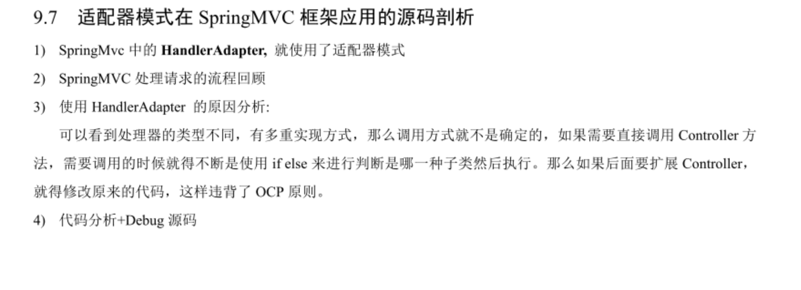
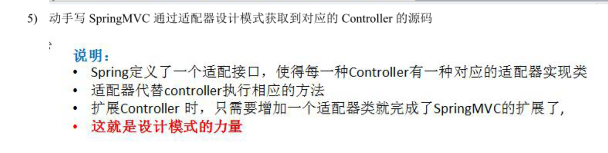
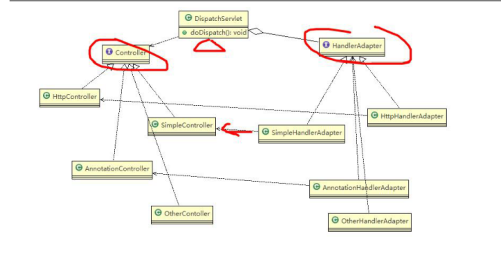
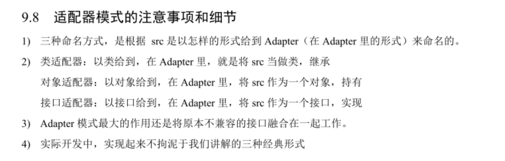

## 类适配器

 

> 注意事项

1. Java的类是单继承机制，所以类适配器需要继承src类这一点算是一个缺陷，因为这要求dst必须是接口，有一定局限性；
2. src类的方法在Adapter中都会暴露出来，也增加了使用的成本；
3. 由于其继承了src类，所以它可以根据需求重写src类的方法，是的Adapter的灵活性增强了；

## 对象适配器

- 基本思路和类的适配器模式相同，只是将Adapter类做修改，不是继承src类，而是持有src类的实例，来解决兼容性问题。即：持有src类，实现dst类接口，完成src -> dst 的适配
- 根据**"合成复用原则"**,在系统中尽量使用关联关系（聚合）来代替 继承关系。
- 对象适配器是适配器模式中常用的一种。

 

 

## 接口适配器

 

 

## SpringMVC的应用

 

 

## 总结

